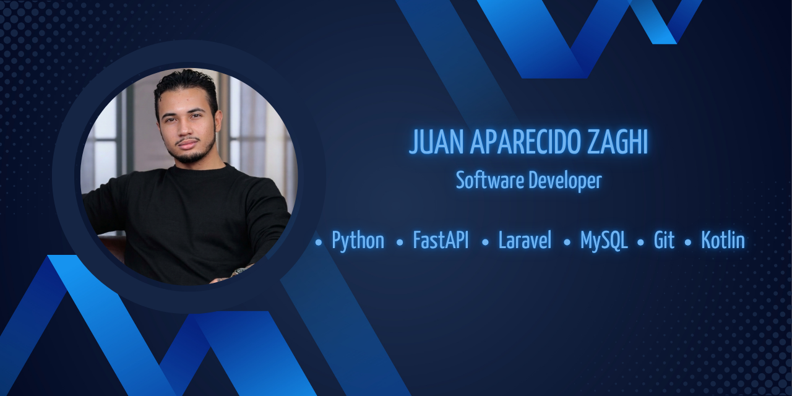

  

<h2 align="center">
Software Developer
</h2>

<h3 align="center">
  <i>Building software that solves real-world problems</i>
</h3>

🚀 FastAPI • Laravel • Kotlin • Android • MySQL

 

# Hello! 👋 I'm Juan Aparecido Zaghi

Software Developer

Final-year Systems Analysis and Development Student

Passionate about building scalable software solutions.

---

I'm a Software Developer focused on building modern solutions for businesses.

I have experience developing REST APIs, web applications, Android applications and relational databases.

Currently developing a workshop management system and an Electronic Invoice (NF-e) microservice.

---

## 🚀 Currently Working On

- 🚗 UrbanFix — Workshop Management System
- 📄 NF-e Microservice
- 📱 Android Applications
- 🌐 REST APIs with FastAPI
  
---

## 💻 Tecnologias

---

## 📊 GitHub Activity

  

---

## 📫 Contato

📧 Email: **juanapzaghi@gmail.com**

💼 LinkedIn: *[(Juan Zaghi)](https://www.linkedin.com/in/juan-zaghi-80a4562b6?utm_source=share_via&utm_content=profile&utm_medium=member_android)*
